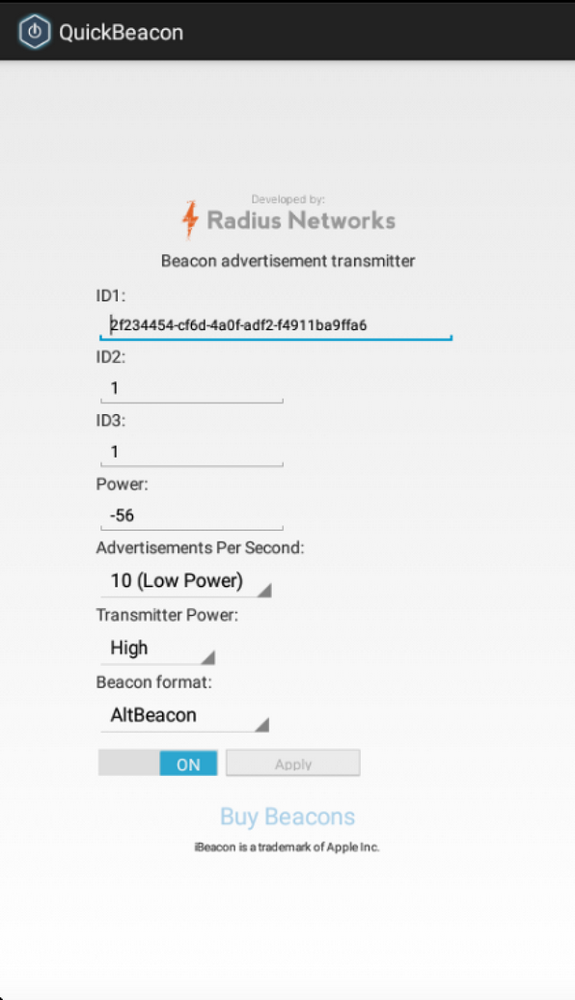

#---
#layout: post
#title: Beacon Transmission With Android 5.0 
#author: David G. Young
#---

One of the most exciting new features of Android 5.0 is the support for Bluetooth LE peripheral mode, which makes it possible to turn an Android device to a beacon transmitter.  Radius Networks is proud to release the new QuickBeacon app for Android 5.0, which creates a configurable beacon supporting both the AltBeacon and Apple iBeacon&#8482;   formats.  This app is available for free for a limited time only in the [Google Play Store](https://play.google.com/store/apps/details?id=com.radiusnetworks.quickbeacon), and works with the new Nexus 6 phone and Nexus 9 tablet.




QuickBeacon for Android makes for an extremely versatile software beacon transmitter, because unlike iOS-based transmitters, it allows you to keep transmitting even when the app is no longer in the foreground.  This makes it suitable for production use on tablets used as point-of-sale (POS) devices where the transmitter app will not always be in the foreground.

The app also allows you to configure the transmitter power, allowing you to adjust how far away the beacon transmission will be detected.  Similarly, you can adjust the transmission frequency of the beacon, allowing you to save battery power if frequent transmissions are not needed.  Neither of these adjustments are available on iOS or OS X-based transmitters.

It is important to note that not all devices with Android 5.0 can send beacon transmissions.  The Android device must have Bluetooth LE hardware and it must have peripheral mode enabled by the device manufacturer.   Google surprised many people when it [disabled peripheral mode for their Nexus 5 and Nexus 7 devices](https://code.google.com/p/android-developer-preview/issues/detail?id=1570), meaning these devices cannot transmit beacon advertisements using QuickBeacon or other software.  This can be confusing for folks using the Google Play store, because it does not have a capabilities filter for BLE peripheral mode.  As a result, QuickBeacon must be installed and tested on each Android 5.0 model before it is known whether or not the app is compatible with that model.  If the Android model does not support BLE peripheral mode, the app will tell you right away.

The engine that supports transmitting as a beacon is included in the open source Android Beacon Library 2.0.  This library allows for configuring flexible beacon formats using the `BeaconParser` class.  The library version that powers beacon transmission is still in pre-release form on the android-l-apis branch [here](https://github.com/AltBeacon/android-beacon-library/tree/android-l-apis).  Using this software, setting up a beacon transmitter is as simple as:

```java
Beacon beacon = new Beacon.Builder()
       	.setId1(“2f234454-cf6d-4a0f-adf2-f4911ba9ffa6”)
       	.setId2(“1”)
       	.setId3(“2”)
        .setManufacturer(0x0118)
        .setTxPower(-59)
        .setDataFields(Arrays.asList(new Long[] {0l}))
        .build();
BeaconParser beaconParser = new BeaconParser()
        .setBeaconLayout("m:2-3=beac,i:4-19,i:20-21,i:22-23,p:24-24,d:25-25");
BeaconTransmitter beaconTransmitter = new BeaconTransmitter(getApplicationContext(), beaconParser);	
beaconTransmitter.startAdvertising(beacon, new AdvertiseCallback() {
    @Override
    public void onStartFailure(int errorCode) {}
    @Override
    public void onStartSuccess(AdvertiseSettings settingsInEffect) {}
});

```

We encourage developers to try this out and send feedback on Github.

Since the release of our Android Beacon Library last year, Radius Networks has been leading the way on providing beacon support for the Android platform.  Now that peripheral mode support is available on Android 5.0, we’re pleased to be able to bring beacon transmission tools and apps to Android.

