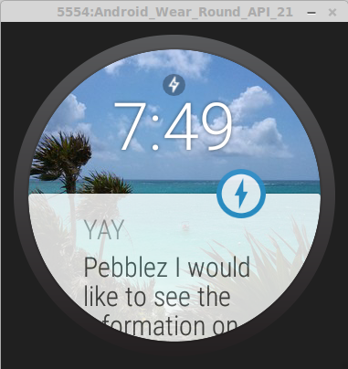
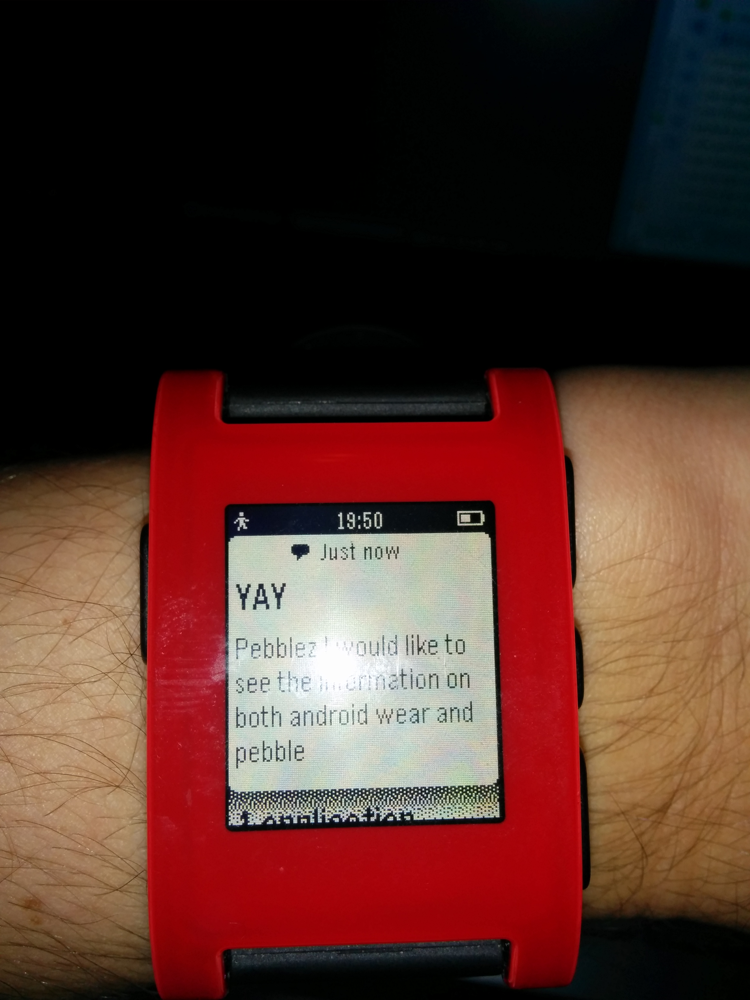

Smartwatches have grown in popularity in the past year, originating with the
Pebble smartwatch on Kickstarter. Then Android wear over this summer with the
Apple Watch being released "early next year". These devices lend themselves
to CampaignKit fantastically displaying a nice little nugget of information,
the same that you would have in a push notification. The following will show you
how to get campaigns to show up on Android Wear devices and the Pebble in 
Android.

It is assumed you are familiar with CampaignKit, and Android Studio, and have an
active Campaign to display.

##Setup

First you are going to need the android studio reference app provided [here](https://github.com/RadiusNetworks/campaignkit-reference-android-studio).
Follow the instructions provided there and make sure that you can watch your
campaign trigger on the app before continuing.

##Android Wear

First off unless you already have an Android Wear device you are going to need
to set up an emulator to connect to your phone so you can see your campaign 
show up on the watch. Documentation for setting up an emulator can be found [here](https://developer.android.com/training/wearables/apps/creating.html) Documentation for setting up an emulator can be found [here](https://developer.android.com/training/wearables/apps/creating.html).

Once all of that is setup it is time to send the campaign information to the watch.

The following code builds a notification to send to the Android Wear device and
then sends it. This is most naturally placed in your `didFindCampaign(Campaign c)`

	Intent viewIntent = new Intent(this, MainActivity.class);
	PendingIntent viewPendingIntent = PendingIntent.getActivity(this, 0, viewIntent, 0);
	NotificationCompat.Builder notificationBuilder = new NotificationCompat.Builder(this)
	        .setSmallIcon(R.drawable.ic_launcher)
	        .setContentTitle(c.getTitle())
	        .setContentText(c.getMessage())
	        .setContentIntent(viewPendingIntent);
	NotificationManagerCompat notificationManager = NotificationManagerCompat.from(this);
	notificationManager.notify(001, notificationBuilder.build());

The view Intent subsequently use in viewPendingIntent is where you can decide
what kind of interaction you want the user to be able to have with the notification.
Perhaps you would like a specific app opened? Here we reopen the reference app.
If you simply want the notification to be dismissed upon reading, the intent is 
unnecessary.

##Pebble

Because Pebble is not specific to android it has a separate framework. More
documentation can be found at developer.getpebble.com. However what you need for
communication here is as follows

In build.gradle we need to add the pebble dependencies and repositories

        dependencies {
    		compile 'com.getpebble:pebblekit:2.6.0'
    	}
    	repositories {
    		mavenCentral()
    		maven { url "https://oss.sonatype.org/content/groups/public/"}
    	}

It is very important that you resync your project at this point. It may take a
while as it downloads pebblekit

Pebble uses JSON structures to communicate packets of data between the watch
and app so the following imports must be included

	import org.json.JSONArray;
	import org.json.JSONObject;

Finally we need to build our notification to send. This should be included in
`didFindCampaign(Campaign c)` just like the Android Wear notification.

	final Intent i = new Intent("com.getpebble.action.SEND_NOTIFICATION");
        final Map data = new HashMap();
        data.put("title", c.getTitle());
        data.put("body", c.getMessage());
        final JSONObject jsonData = new JSONObject(data);
        final String notificationData = new JSONArray().put(jsonData).toString();
        i.putExtra("messageType", "PEBBLE_ALERT");
        i.putExtra("sender", "MyApplication");
        i.putExtra("notificationData", notificationData);
        sendBroadcast(i);

This type of notification can only be dismissed. However the recent Pebble Beta
claims to support Android Wear type notifications. As the beta continues I'm
sure we will see more information on how to make that kind of notification on
Pebble.
