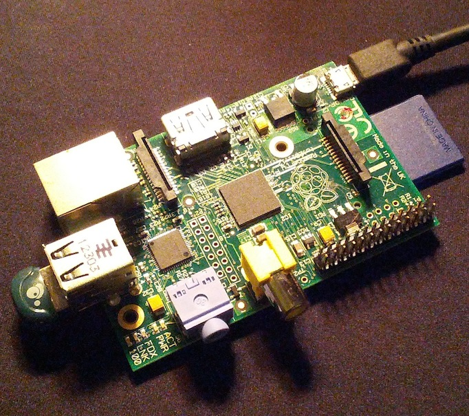

##iBeacon Development Kit

###Available NOW.  Shipping included for only $99.99*  - WOW!

Get started developing iBeacon apps now with your own dedicated hardware iBeacon.  
Just plug it in with your own cell phone charger, and your app start getting iBeacon hits within seconds.  

Each fully assembled kit includes:

* Raspberry Pi computer board
* Bluetooth LE dongle
* 8 MB SD Card, pre-loaded with iBeacon software that's fully compatible with Apple's iBeacon SDK
* Full instructions for customizing the iBeacon identifiers

Order Today!

&#42; Usually shipped same day for orders placed by 10 a.m. Monday-Friday US Eastern Time.  Free domestic delivery is via US Priority mail (2-3 day service).  Express and international delivery available at additional cost.  
&#42;&#42; Standard 5V micro USB charger (cell phone or tablet style) required, not included.  
