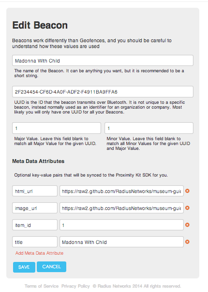

## Museum Guide Setup Instructions

These instructions describe how to set up a custom museum guide or tour using Radius Networks' open source Museum Guide app.
The rest of this document describes how to set up a new guide with an unmodified app, although the same steps apply to a customized app as well.

###Step 1. Decide on the exhibits or items in your tour

Pick interesting items that will be included in the tour.  Each one will need a title e.g. "Madonna with Child", an item number (this can also
be a sequential number 1,2,3... etc.)  You will also need an image of each item and a text description.  For a typical tour, between 6 and 50 items
might be expected.  Start small and add more after you get a few working.

###Step 2. Get your iBeacons

However many items you have on your tour, you'll need to order at least the same number of [iBeacons](http://www.radiusnetworks.com/buy-beacons.html) (and more if you want spares.)  Each one must be assigned a different
three part identifier.  Write down which target is associated with which iBeacon three part identifier.

###Step 3. Create images for each item

You will need one image per item, at least 320 pixels in the largest dimension.  The file may be named whatever you want, but it must be uploaded to a 
web server.

###Step 4. Create a description page for each item

You will need a text description page for each item uploaded to a web server.  It may be plain text or simple HTML formatting, but HTML files should not include embedded
images or other multimedia elements.  The file must be uploaded to a web server.

###Step 5. Configure ProximityKit

If you don't have a [ProximityKit](http://www.proximitykit.com) account already, create one.  You can use the free service license if you expect to have 100 people or fewer playing your scavenger hunt.  See plans for details.

Create a new Kit, then define one iBeacon for each museum guide item.  For each one, you'll need to enter the three-part iBeacon identifier along wtih two key/value pairs.  The first key/value pair
has a key of "item_id" and a value of your item or catalog number.  If you don't have a museum catalog number, put "1" for your first item, "2" for your second item, etc.  
The second key/value pair is for your "image_url" of your picture image for that target.  The third key/value pair is the "html_url" of the description page for your item.  The fourth key/value pair is the
"title" of your item.  In the example museum guide, the first item is set up like this:

    Key         Value
    ---         -----
    item_id     1
    image_url   https://raw2.github.com/RadiusNetworks/museum-guide-sample-assets/master/cuzquena_mother.html
    html_url    https://raw2.github.com/RadiusNetworks/museum-guide-sample-assets/master/cuzquena_mother.jpg
    title       Madonna With Child
    

When you are done, your setup should look like this for a single target:

###Step 6. Distribute your 8-digit hunt code.

When using the Radius Museum Guide apps, your museum or tour is selected by particpants by entry of an 8-digit code.  This code can then be distributed to your
participants by posting it on a sign or a website, sending it to them via email, etc.  You may request an 8-digit code by sending an email to support@radiusnetworks.com including your ProximityKit kit URL.

Once you receive confirmation that your code is live, you can try out your museum guide.

