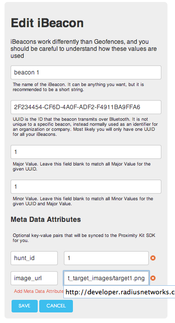

## iBeacon Scavenger Hunt Setup Instructions

These instructions describe how to set up a scavenger hunt using Radius Networks' Beacon Scavenger Hunt app available in the iOS AppStore and the Google Play store.
You may also customize the application itself, as we have releaed both the iOS and Android versions as open source.  The rest of this document 
describes how to set up a new hunt with the Radius Networks Beacon Scavenger Hunt apps, although the same steps apply to your own app (except 
publishing a hunt code.)

###Step 1. Decide on your targets

Pick interesting targets that are more than 10 meters apart and can be associated with a visual icon.  We recommend 6-12 targets.  Picking target locations
with AC or USB power will allow you to use powered beacons.  Picking indoor locations will allow you to avoid setting up weatherproof enclosures
for your iBeacons.

###Step 2. Get your iBeacons

However many targets you have, you'll need to order at least the same number of iBeacons (and more if you want spares.)  Each one must be assigned a different
three part identifier.  Write down which target is associated with which iBeacon three part identifier.

###Step 3. Create badge images for each target location

Making badge images requires the most work.  You will need to make two different badge images for each location -- one to indicate a target that is not
found and one to indicate a target that is found.  Depending on what platforms you want to support, you will need other variants of these badges, too.

At a minimum, you need one standard resolution badge pair (found / not found) for each target for use on non-retina iPhones and smaller Android phones. They should be named like below, and uploaded to a web server.
Once you have them uploaded, write down the mapping between each target and each image URL.

target1.png 
target1_found.png 
target2.png
target2_found.png
...

Note: If you want the sharpest-looking images for higher density displays on iPhone and iPad, you will need to create another set of images for high density displays. If you want the sharpest-looking images for Android, you will need to make yet other versions of each badge image.  Full details on the image filenames needed to do this are at the bottom of this document.

###Step 4. Configure ProximityKit

If you don't have a ProximityKit account already, create one.  You can use the free service license if you expect to have 100 people or fewer
playing your scavenger hunt.  See plans for details.

Create a new Kit, then define one iBeacon for each scavenger hunt target.  For each one, you'll need to enter the three-part iBeacon identifier along wtih two key/value pairs.  The first key/value pair
has a key of "hunt_id" and a value of your target number.  Put "1" for your first target, "2" for your second target, etc.  The second key/value pair is for your "image_url" of your badge image for that target.  You only need to 
specify the "image_url" for the basic image, because the variants will all be discovered by following the filename conventions described in this document.

When you are done, your setup should look like this for a single target:

###Step 5. Distribute your 8-digit hunt code.  

Note:  This step is only necessary if you are using the Radius Networks app.  If you are using a custom app, users will not have to enter a hunt code because the configuration will
be loaded automatically by embedding your ProximityKit.plist or ProximityKit.properties file in your app.

When using the Radius iBeacon Scavenger Hunt apps, your hunt is selected by particpants by entry of an 8-digit code.  This code can then be distributed to your
participants by posting it on a sign or a website, sending it to them via email, etc.  Turning on an 8-digit code will eventually be selectable in the ProximityKit web interface.  For now, creating this code is a manual process which must be requested with an email to support@radiusnetworks.com that must include your ProximityKit kit URL.

Once the Radius support team receives this request, they will create a file in our Amazon S3 instance.  For the 00000000 code, the file is at s3.amazonaws.com/pkcode.radiusnetworks.com/api/configurations/00000000 and looks like this:

        {
            "api_token": "85d437ed764da689a1b0448236c494adb39d698e9581eec69363d5b3d13c30ce",
            "PKKitURL": "http://www.proximitykit.com/api/kits/723"
        }

Once you receive confirmation that your code is live, you can try out your scavenger hunt.

## Appendix A:  Full details on image filenames

##### Bare minimum for iPhone and Android Phones

    target1.png 
    target1_found.png

These images should be 130x130 pixels.

#####Additional images required for iPhone retina displays:

    target1_260.png
    target1_found_260.png

These images should be 260x260 pixels.

#####Additional images required for iPad

    target1_312.png 
    target1_624.png 
    target1_found_312.png 
    target1_found_624.png

These image sizes should be as indicated in the suffix.

#####Additional images required for optimizing Android phone and tablet screen sizes and densities:

    target1_438.png 
    target1_found_438.png 
    target1_1040.png 
    target1_found_1040.png

These image sizes should be as indicated in the suffix.

The app will attempt to use the largest image available to fit the device's screen, falling back to the smallest image if the optimal size is not available.

